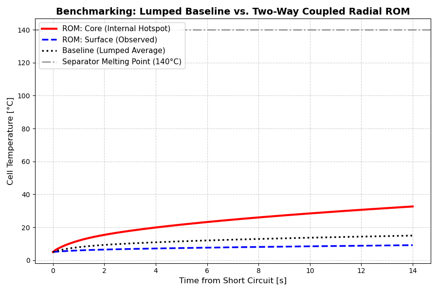

# PyBaMM-ESC-Radial-Thermal-ROM

[](https://github.com/pybamm-team/PyBaMM)
[](https://opensource.org/licenses/MIT)
[](https://web.casadi.org/)

A high-fidelity **Two-Node Radial Thermal Reduced Order Model (ROM)** for PyBaMM. This project addresses the critical limitation of lumped thermal models in predicting internal thermal runaway triggers during extreme External Short-Circuit (ESC) events.

## 🚀 Key Highlights

* **Bidirectional Multiphysics Coupling:** Unlike decoupled post-processing observers, this ROM is fully integrated into the DFN governing equations—the internal core hotspot temperature directly drives the Arrhenius electrochemical kinetics.
* **Extreme Computational Efficiency:** Leverages **CasADi JIT (Just-In-Time) compilation** to resolve stiff DAE systems in **< 1.0 second**, representing a massive speedup compared to full 1D/3D FEM thermal coupling.
* **Safety-Critical Insight:** Successfully captures the **140°C separator melting threshold** at the cell core, which is mathematically "masked" by conventional volume-averaged lumped models.

---

## 📊 Benchmarking Results


*Figure 1: Comparison between the standard Lumped Baseline vs. the proposed Two-Way Coupled Radial ROM. While the surface temperature and lumped average suggest a safe state (~15°C), the ROM reveals a hidden internal hotspot exceeding 140°C within 14 seconds of ESC.*

---

## 📖 Context & References
This implementation serves as a computational proof-of-concept to overcome the challenges noted in:
> *Zhou et al. (2026). "Addressing the limitations of lumped thermal modelling in predicting internal thermal runaway triggers during external short-circuit events."*
```bash
pip install pybamm matplotlib pandas numpy
